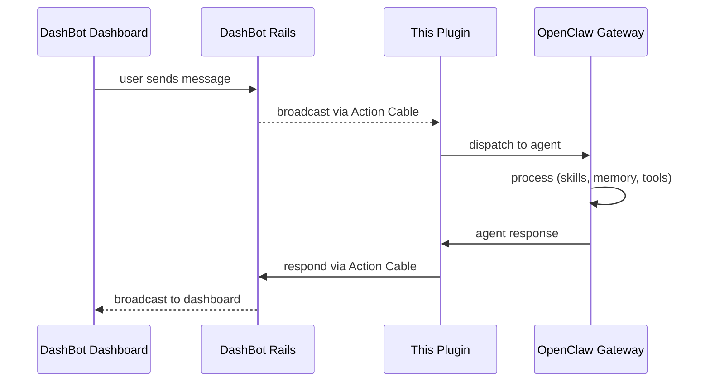
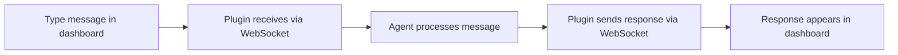
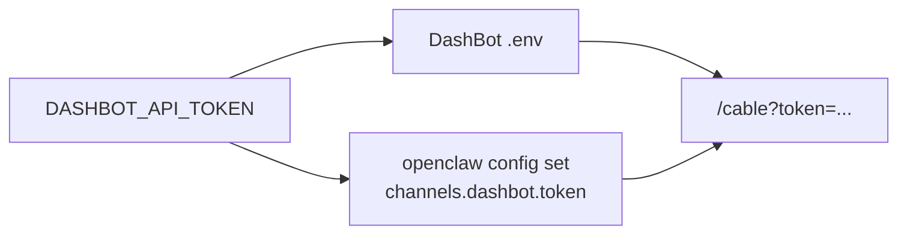
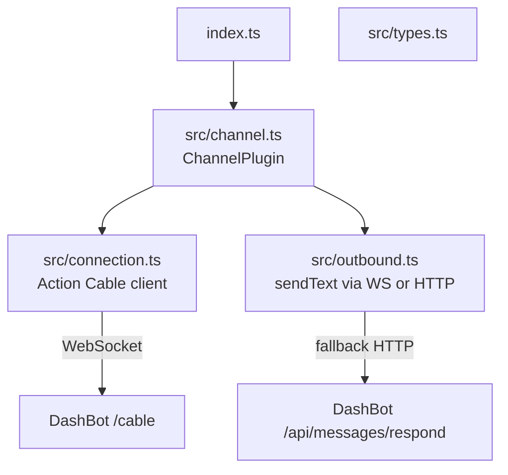
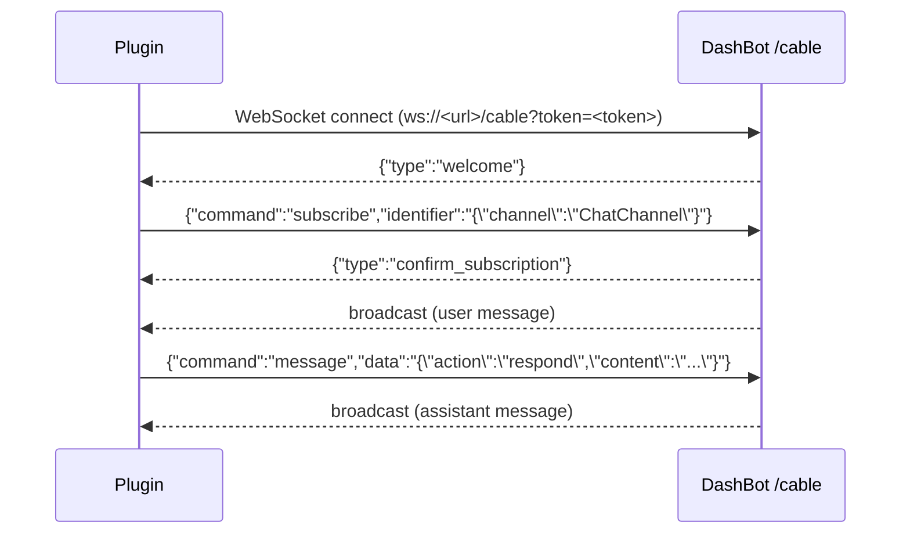

# dashbot-openclaw

[OpenClaw](https://openclaw.ai/) channel plugin for [DashBot](https://github.com/eddanger/dashbot) — connects your OpenClaw agent to the DashBot dashboard over Action Cable (WebSocket).




## Quick start

### Prerequisites

- [DashBot](https://github.com/eddanger/dashbot) Rails server running (with `DASHBOT_API_TOKEN` set)
- [OpenClaw](https://openclaw.ai/) gateway installed (`openclaw` CLI available)

### 1. Clone and install

```sh
git clone https://github.com/eddanger/dashbot-openclaw.git
cd dashbot-openclaw
npm install
```

### 2. Install into OpenClaw

```sh
openclaw plugins install -l /path/to/dashbot-openclaw
```

### 3. Configure the channel

Point the plugin at your DashBot server. The token must match the `DASHBOT_API_TOKEN` in DashBot's `.env`:

```sh
openclaw config set channels.dashbot.enabled true
openclaw config set channels.dashbot.url http://localhost:3000
openclaw config set channels.dashbot.token <your DASHBOT_API_TOKEN>
```

### 4. Restart the gateway

```sh
openclaw gateway restart
```

### 5. Verify

```sh
openclaw logs
```

You should see:

```
[default] connecting to http://localhost:3000
Subscribed to ChatChannel
```

Open the DashBot dashboard, type a message — the gateway logs show the round-trip:

```
[default] inbound: Hello!
[default] outbound: Hi there! How can I help?
```



## Production

To point the plugin at a deployed DashBot instance instead of localhost:

```sh
openclaw config set channels.dashbot.url https://dashbot.example.com
openclaw gateway restart
```

Verify the token matches `DASHBOT_API_TOKEN` on the server:

```sh
openclaw config get channels.dashbot.token
```

After restarting, the gateway logs should show:

```
Connecting to wss://dashbot.example.com/cable?token=...
WebSocket connected
Subscribed to ChatChannel
```

## Configuration reference

| Key | Description |
|-----|-------------|
| `channels.dashbot.enabled` | Enable/disable the channel (`true` / `false`) |
| `channels.dashbot.url` | Base URL of your DashBot instance |
| `channels.dashbot.token` | API token matching `DASHBOT_API_TOKEN` on the DashBot server |

Set values via CLI:

```sh
openclaw config set channels.dashbot.<key> <value>
```

Or edit the gateway config file directly:

```json
{
  "channels": {
    "dashbot": {
      "enabled": true,
      "url": "https://dashbot.example.com",
      "token": "<DASHBOT_API_TOKEN>"
    }
  }
}
```

## Token setup

Both DashBot and the plugin share a single API token. Generate one and use it in both places:

```sh
ruby -e "require 'securerandom'; puts SecureRandom.hex(32)"
```



- **DashBot side:** set `DASHBOT_API_TOKEN` in `.env` and restart Rails
- **Plugin side:** `openclaw config set channels.dashbot.token <token>` and restart gateway

## How it works



- **connection.ts** — Raw WebSocket client implementing the Action Cable protocol (subscribe, receive broadcasts, send messages). Auto-reconnects on disconnect.
- **outbound.ts** — Sends assistant responses over WebSocket, falling back to HTTP POST if the socket isn't connected.
- **channel.ts** — OpenClaw `ChannelPlugin` that starts the connection, listens for user messages, and dispatches them to the gateway runtime.
- **types.ts** — TypeScript interfaces for DashBot messages and Action Cable framing.

### Action Cable protocol



## Development

```sh
npm install
npm run dev          # tsc watch mode
npm test             # vitest
npm run check        # type-check
npm run lint         # eslint
```

After making changes, restart the gateway to reload the plugin:

```sh
openclaw gateway restart
```

## Related

- [DashBot](https://github.com/eddanger/dashbot) — the Rails app (dashboard, API, Action Cable server)
- [OpenClaw](https://openclaw.ai/) — AI agent gateway
