# dashbot-openclaw

[OpenClaw](https://openclaw.ai/) plugin that connects your AI agent to [DashBot](https://github.com/wembledev/dashbot) — giving it a real-time dashboard with chat, status monitoring, and agentic cards.

* **Real-time:** Two-way communication over Action Cable WebSockets — messages stream instantly.
* **Zero config:** Auto-detects memory backend (QMD or OpenClaw SQLite) and status sources.
* **Lightweight:** Single plugin, no external dependencies beyond OpenClaw and DashBot.

[![CI][ci-badge]][ci-url]
[![Node][node-badge]][node-url]
[![License: MIT][mit-badge]][mit-url]

[ci-badge]: https://github.com/wembledev/dashbot-openclaw/actions/workflows/ci.yml/badge.svg?branch=main
[ci-url]: https://github.com/wembledev/dashbot-openclaw/actions/workflows/ci.yml
[node-badge]: https://img.shields.io/badge/Node-22+-green.svg
[node-url]: https://nodejs.org/
[mit-badge]: https://img.shields.io/badge/license-MIT-blue.svg
[mit-url]: https://github.com/wembledev/dashbot-openclaw/blob/main/LICENSE

## How It Works

```mermaid
graph TD
    Dashboard["🖥️ Dashboard"]
    DashBot["⚡ DashBot"]
    Plugin["🔌 This Plugin"]
    Gateway["🤖 OpenClaw Gateway"]

    Dashboard <--> DashBot
    DashBot <-->|Action Cable| Plugin
    Plugin <--> Gateway
```



The plugin runs inside your OpenClaw gateway and connects to DashBot's Action Cable server. When a user sends a message in the dashboard, it flows through the plugin to the agent and back. The plugin also streams agent status data (sessions, cron jobs, memory stats) for the status page.

## Quick Start

### Prerequisites

- [DashBot](https://github.com/wembledev/dashbot) running (with `DASHBOT_API_TOKEN` set)
- [OpenClaw](https://openclaw.ai/) gateway installed

### Install

```sh
git clone https://github.com/wembledev/dashbot-openclaw.git
cd dashbot-openclaw
npm install
openclaw plugins install -l /path/to/dashbot-openclaw
```

### Configure

Point the plugin at your DashBot instance. The token must match `DASHBOT_API_TOKEN` in DashBot's `.env`:

```sh
openclaw config set channels.dashbot.enabled true
openclaw config set channels.dashbot.url http://localhost:3000
openclaw config set channels.dashbot.token <your-token>
openclaw gateway restart
```

### Verify

```sh
openclaw logs
```

You should see:

```
Subscribed to ChatChannel
```

Open the DashBot dashboard and send a message — it round-trips through the agent.

## Configuration

| Key | Description |
|-----|-------------|
| `channels.dashbot.enabled` | Enable/disable the channel |
| `channels.dashbot.url` | Base URL of your DashBot instance |
| `channels.dashbot.token` | Shared API token (must match DashBot's `DASHBOT_API_TOKEN`) |

Generate a token:

```sh
ruby -e "require 'securerandom'; puts SecureRandom.hex(32)"
```

Set it in both places — DashBot's `.env` and the plugin config.

## Status Page

The plugin automatically provides real-time agent status to DashBot's status page — no extra configuration needed.

| Data | Source |
|------|--------|
| Sessions | OpenClaw session state |
| Cron jobs | OpenClaw cron state |
| Memory | QMD (auto-detected) or OpenClaw SQLite |

Override the memory backend with `DASHBOT_MEMORY_BACKEND=qmd` or `DASHBOT_MEMORY_BACKEND=openclaw`.

## Architecture

```
index.ts          → Plugin entry point
src/channel.ts    → OpenClaw ChannelPlugin (chat + status commands)
src/connection.ts → Action Cable WebSocket client (auto-reconnect)
src/outbound.ts   → Sends responses over WebSocket (HTTP fallback)
src/status-reporter.ts → Reads OpenClaw state, streams to dashboard
src/types.ts      → TypeScript interfaces
```

## Development

```sh
npm install
npm run dev        # tsc watch mode
npm test           # vitest
npm run check      # type-check
npm run lint       # eslint
```

After changes, restart the gateway to reload:

```sh
openclaw gateway restart
```

## Testing

```sh
npm test           # run all tests
npm run test:watch # watch mode
```

## Related

- [DashBot](https://github.com/wembledev/dashbot) — the Rails dashboard app
- [OpenClaw](https://openclaw.ai/) — AI agent gateway

## License

This project is licensed under the [MIT License](LICENSE).
